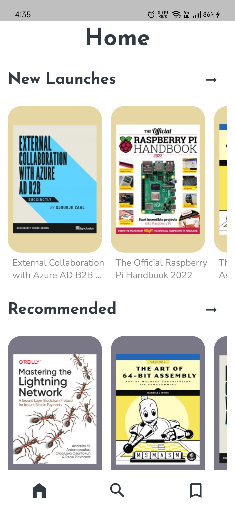
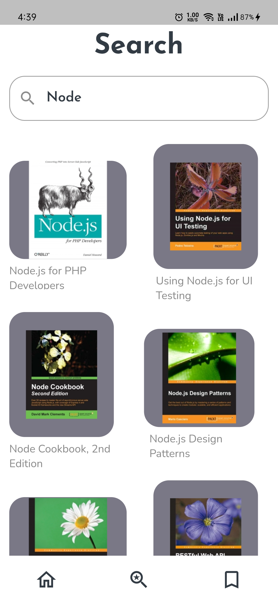
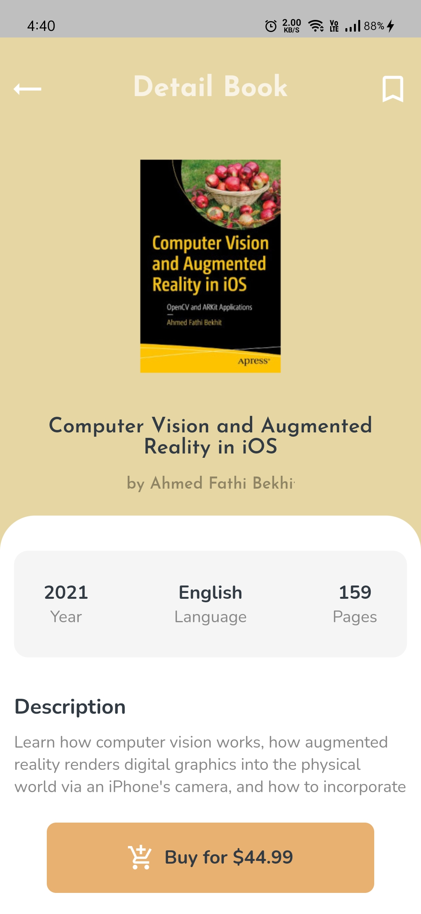
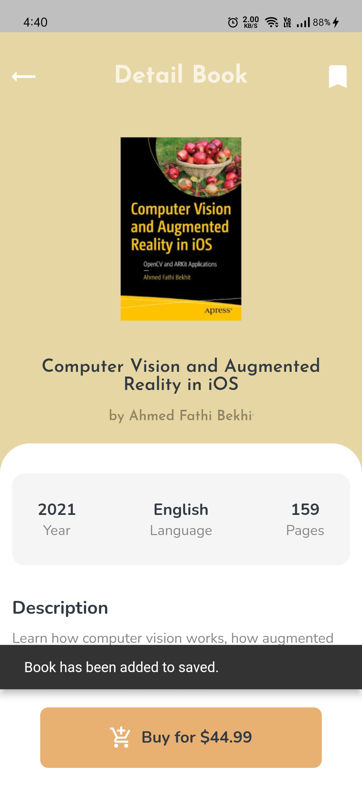

# BookStore

A flutter application for IT book lovers to stay updated with new book releases.

[![Watch the video]](https://drive.google.com/file/d/1EQSOOdKvbISPVkjplKBDRtFKtti3U2TA/view?usp=sharinghttps://drive.google.com/file/d/1EQSOOdKvbISPVkjplKBDRtFKtti3U2TA/view?usp=sharing)

#### Features: 

1. Get new book releases
2. Get book recommendations
3. Search books with title, author or keyword
4. Save favorite books

#### Approach: 

The project follows **MVC architecture** with **GetX** as a StateManagement library. It follows a simple UI and strong backend architecture. It utilizes dependency injection with "Get". Browse the code to know more.

#### Resources: 

* Books API - https://api.itbook.store/
* GetX package - https://pub.dev/packages/get

## Getting Started

- [Lab: Write your first Flutter app](https://flutter.dev/docs/get-started/codelab)
- [Cookbook: Useful Flutter samples](https://flutter.dev/docs/cookbook)

[online documentation](https://flutter.dev/docs)